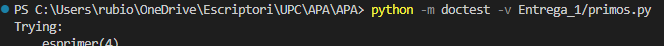
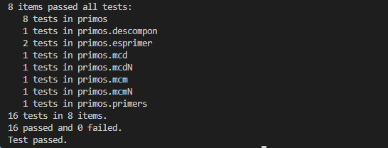

# Segunda tarea de APA 2023: Manejo de números primos

## Nom i cognoms: Bernat Rubiol

## Fitxer `primos.py`

- L'alumne ha d'escriure el fitxer `primos.py` que incorporarà diferents funcions relacionades amb el maneig
 dels nombres primers.

- El fitxer ha d'incloure una cadena de documentació que inclourà el nom de l'alumne i els tests unitaris
 de les funcions incloses.

- Cada funció haurà d'incloure la seva pròpia cadena de documentació que indicarà la comesa de la funció, els
 arguments de la mateixa i la sortida proporcionada.

- Es valorarà el pytònic de la solució; en concret, la seva claredat i senzillesa, i l'ús dels estàndards marcats
 per PEP-8. També se'n valorarà l'eficiència computacional.

### Determinació de la _primalitat_ i descomposició d'un nombre en factors primers

Incloeu al fitxer `primos.py` les tres funcions següents:

- `esPrimo(numero)` Retorna `True` si el seu argument és primer, i `False` si no ho és.
- `primos(numero)` Retorna una **tupla** amb tots els nombres primers menors que el seu argument.
- `descompon(numero)` Retorna una **tupla** amb la descomposició en factors primers del seu argument.

### Obtenció del mínim comú múltiple i el màxim comú divisor

Usant les tres funcions de l'apartat anterior (i qualsevol altra que considereu convenient afegir), escriviu-ne d'altres
dos que calculin el màxim comú divisor i el mínim comú múltiple dels seus arguments:

- `mcm(número1, numero2)`: Retorna el mínim comú múltiple dels seus arguments.
- `mcd(numero1, numero2)`: Retorna el màxim comú divisor dels seus arguments.

Aquestes dues funcions han de complir les condicions següents:

- Encara que es tracti d'una solució subòptima, en tots dos casos s'haurà de partir de la descomposició en factors
 cosins dels arguments usant les funcions de l'apartat anterior.

- Encara que també sigui subòptim des del punt de vista de la programació, cap de les dues funcions pot
 dependre de l'altra; cadascuna s'ha de programar per separat.

### Obtenció del mínim comú múltiple i el màxim comú divisor per a un nombre arbitrari d'arguments

Escriviu les funcions `mcmN()` i `mcdN()`, que calculen el mínim comú múltiple i el màxim comú divisor per a un
nombre arbitrari d'arguments:

- `mcm(*numeros)`: Retorna el mínim comú múltiple dels seus arguments.
- `mcd(*numeros)`: Retorna el màxim comú divisor dels seus arguments.

### Tests unitaris

La cadena de documentació del fitxer ha dincloure els tests unitaris de les cinc funcions. En concret, hauran de
comprovar-se les condicions següents:

- `esPrimo(numero)`: En executar `[ numero for numero in range(2, 50) if esPrimo(numero) ]`, la sortida ha de ser
 `[2, 3, 5, 7, 11, 13, 17, 19, 23, 29, 31, 37, 41, 43, 47]`.
- `primos(numeor)`: En executar `primos(50)`, la sortida ha de ser `(2, 3, 5, 7, 11, 13, 17, 19, 23, 29, 31, 37, 41, 43, 47)`.
- `descompon(numero)`: En executar `descompon(36 * 175 * 143)`, la sortida ha de ser `(2, 2, 3, 3, 5, 5, 7, 11, 13)`.
- `mcm(num1, num2)`: En executar `mcm(90, 14)`, la sortida ha de ser `630`.
- `mcd(num1, num2)`: En executar `mcd(924, 780)`, la sortida ha de ser `12`.
- `mcmN(numeros)`: En executar `mcm(42, 60, 70, 63)`, la sortida ha de ser `1260`.
- `mcdN(numeros)`: En executar `mcd(840, 630, 1050, 1470)`, la sortida ha de ser `210`.

### Lliurament

#### Execució dels tests unitaris

Inseriu a continuació una captura de pantalla que mostri el resultat d'executar el fitxer `primos.py` amb l'opció
_verbosa_, de manera que es mostri el resultat de l'execució dels tests unitaris.




#### Codi desenvolupat

Inseriu a continuació el contingut del fitxer `primos.py` usant les ordres necessàries perquè es realitzi el
realç sintàctic a Python del mateix.

```py
"""
Bernat Rubiol

>>> esprimer(4)
False

>>> esprimer(-2)
True

>>> primers(50)
(2, 3, 5, 7, 11, 13, 17, 19, 23, 29, 31, 37, 41, 43, 47)

>>> descompon(36 * 175 * 143)
(2, 2, 3, 3, 5, 5, 7, 11, 13)

>>> mcm(90, 14)
630

>>> mcd(924, 780)
12

>>> mcmN(42, 60, 70, 63)
1260

>>> mcdN(840, 630, 1050, 1470)
210
"""

def esprimer(num):
    """
    Calcula si num entrant es primer o no
    
    >>> esprimer(4)
    False

    >>> esprimer(-2)
    True

    """
    for test in range(2, num):
        if num%test == 0:
            return False
        
    return True

def primers(num):
    """Retorna una tupla amb tots els nombres primers menors que num.
    >>> primers(50)
    (2, 3, 5, 7, 11, 13, 17, 19, 23, 29, 31, 37, 41, 43, 47)
    """
    primers_trobats = []
    for n in range(2, num):
        if esprimer(n):
            primers_trobats.append(n)
    return tuple(primers_trobats)

def descompon(num):
    """Retorna una tupla amb la descomposició en factors primers de num.
    >>> descompon(36 * 175 * 143)
    (2, 2, 3, 3, 5, 5, 7, 11, 13)
    """
    factors = []
    div = 2
    while num > 1:
        while num % div == 0:
            factors.append(div)
            num //= div
        div += 1
    return tuple(factors)

def mcm(num1, num2):
    """Retorna el mínim comú múltiple de dos nombres.
    
    >>> mcm(90, 14)
    630
    """
    factors1 = descompon(num1)
    factors2 = descompon(num2)
    factors_comuns = set(factors1) | set(factors2)
    resultat = 1
    for factor in factors_comuns:
        quantitat1 = factors1.count(factor)
        quantitat2 = factors2.count(factor)
        exponent = max(quantitat1, quantitat2)
        resultat *= factor ** exponent
    return resultat

def mcd(num1, num2):
    """Retorna el màxim comú divisor de dos nombres.
    
    >>> mcd(924, 780)
    12
    """
    factors1 = descompon(num1)
    factors2 = descompon(num2)
    factors_comuns = set(factors1) & set(factors2)
    resultat = 1
    for factor in factors_comuns:
        quantitat1 = factors1.count(factor)
        quantitat2 = factors2.count(factor)
        exponent = min(quantitat1, quantitat2)
        resultat *= factor ** exponent
    return resultat

def mcmN(*numeros):
    """Retorna el mínim comú múltiple d'un nombre arbitrari d'arguments.
    
    >>> mcmN(42, 60, 70, 63)
    1260
    """
    resultat = numeros[0]
    for num in numeros[1:]:
        resultat = mcm(resultat, num)
    return resultat

def mcdN(*numeros):
    """Retorna el màxim comú divisor d'un nombre arbitrari d'arguments.
    
    >>> mcdN(840, 630, 1050, 1470)
    210
    """
    resultat = numeros[0]
    for num in numeros[1:]:
        resultat = mcd(resultat, num)
    return resultat

if __name__ == "__main__":
    import doctest
    doctest.testmod(verbose=True)
```

#### Subida del resultado al repositorio GitHub ¿y _pull-request_?

El fichero `primos.py`, la imagen con la ejecución de los tests unitarios y este mismo fichero, `README.md`, deberán
subirse al repositorio GitHub mediante la orden `git push`. Si los profesores de la asignatura consiguen montar el
sistema a tiempo, la entrega se formalizará realizando un _pull-request_ al propietario del repositorio original.

El fichero `README.md` deberá respetar las reglas de los ficheros Markdown y visualizarse correctamente en el repositorio,
incluyendo la imagen con la ejecución de los tests unitarios y el realce sintáctico del código fuente insertado.
